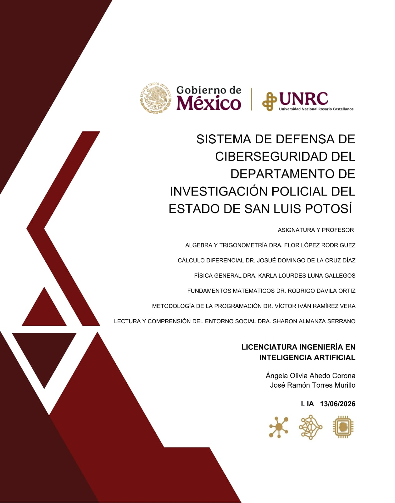

# Sistema de Defensa de Ciberseguridad PDI SLP



## Datos del proyecto

**Nombre del proyecto:** Sistema de Defensa de Ciberseguridad del Departamento de Investigación Policial del Estado de San Luis Potosí  
**Problema prototípico:** Ciberextorsión y Vulnerabilidad Digital en la Era de la Inteligencia Artificial  
**Licenciatura:** Ingeniería en Inteligencia Artificial  
**Institución:** Universidad Nacional Rosario Castellanos  
**Fecha:** 13/06/2026  

**Integrantes:**

- Ángela Olivia Ahedo Corona
- José Ramón Torres Murillo

**Asignaturas y profesores:**

| Asignatura | Profesor(a) |
|---|---|
| Álgebra y Trigonometría | Dra. Flor López Rodríguez |
| Cálculo Diferencial | Dr. Josué Domingo de la Cruz Díaz |
| Física General | Dra. Karla Lourdes Luna Gallegos |
| Fundamentos Matemáticos | Dr. Rodrigo Dávila Ortiz |
| Metodología de la Programación | Dr. Víctor Iván Ramírez Vera |
| Lectura y Comprensión del Entorno Social | Dra. Sharon Almanza Serrano |

## Descripción general

Este repositorio contiene un prototipo académico desarrollado en Python para simular un sistema de defensa de ciberseguridad aplicado a un escenario de referencia del Departamento de Investigación Policial del Estado de San Luis Potosí.

El sistema representa un entorno controlado donde se genera tráfico digital, se simulan posibles ataques, se calculan indicadores matemáticos y físicos, se clasifican estados de riesgo y se generan evidencias mediante consola, gráficas PNG y un reporte CSV.

El proyecto no utiliza datos reales ni infraestructura real. La institución se toma únicamente como escenario académico para analizar riesgos relacionados con ciberextorsión, vulnerabilidad digital, ransomware y protección de información sensible.

## Planteamiento del problema

La seguridad de la información es uno de los desafíos más importantes para organizaciones modernas. El uso constante de sistemas digitales incrementa la exposición a accesos no autorizados, alteración de archivos, salida anormal de datos y ataques de ciberextorsión.

La pregunta principal del proyecto es:

> ¿De qué manera pueden integrarse los conocimientos de programación, matemáticas, física e inteligencia artificial para diseñar un sistema capaz de detectar comportamientos anómalos asociados a posibles incidentes de ciberseguridad?

## Propuesta

La propuesta consiste en una simulación educativa que ejecuta 60 ciclos de monitoreo. En cada ciclo el sistema genera un paquete de actividad digital, evalúa si existe un evento anómalo, calcula indicadores y clasifica el estado operativo.

El sistema permite:

- Generar tráfico digital normal.
- Simular ataques o comportamientos anómalos.
- Evaluar paquetes, intentos de login, cambios de archivos y salida de datos.
- Calcular flujo digital, derivadas, señal periódica e índice oscilatorio.
- Simular variables físicas como CPU, potencia, temperatura y refrigeración.
- Clasificar estados: `NORMAL`, `SOSPECHOSO`, `ALERTA` y `CRITICO`.
- Aplicar cifrado básico y reforzado según el nivel de riesgo.
- Generar evidencias en consola, CSV y gráficas PNG.

## Arquitectura del sistema

El proyecto está organizado por módulos para separar responsabilidades y facilitar la comprensión del programa.

| Archivo | Función principal |
|---|---|
| `m00_pdi_slp.py` | Control principal del sistema y ciclo de simulación. |
| `m01_servidores.py` | Datos base, centrales, usuarios, IPs y umbrales. |
| `m02_trafico_normal.py` | Generación de paquetes normales. |
| `m03_atacante.py` | Simulación de ataques o alteraciones. |
| `m04_logica_matematica.py` | Cálculos, reglas lógicas, cifrado y física. |
| `m05_monitor.py` | Salida en consola y panel de monitoreo. |
| `m06_graficas.py` | Generación de gráficas PNG. |
| `m07_reporte_tabla.py` | Exportación del historial a CSV. |

## Flujo general

1. Se cargan datos base de servidores, usuarios, IPs y umbrales.
2. El usuario inicia la simulación.
3. El sistema ejecuta 60 ciclos de monitoreo.
4. En cada ciclo se genera tráfico normal.
5. Puede inyectarse un ataque simulado.
6. Se calculan métricas matemáticas y físicas.
7. Se evalúa el estado operativo.
8. Se activan protecciones si corresponde.
9. Se guarda el historial.
10. Al finalizar, se generan gráficas y reporte CSV.

## Variables analizadas

El sistema utiliza variables de identificación, comportamiento digital, análisis matemático, monitoreo físico y protección.

Algunas variables principales son:

- `central`
- `usuario`
- `ip`
- `paquetes`
- `intentos_login`
- `cambios_archivos`
- `salida_datos`
- `flujo`
- `indice_oscilatorio`
- `temperatura`
- `estado`
- `cifrado`

## Reglas de decisión

La clasificación del sistema se basa en reglas lógicas y umbrales.

| Condición | Resultado |
|---|---|
| Usuario no autorizado | Estado `ALERTA`. |
| Paquetes altos e intentos de login elevados | Estado `ALERTA` y cifrado activado. |
| Cambios de archivos sospechosos | Alerta de manipulación de expediente. |
| Salida de datos elevada | Posible cifrado por salida de datos. |
| Paquetes o flujo en nivel crítico | Estado `CRITICO` y cifrado reforzado. |
| Índice oscilatorio crítico | Estado `CRITICO` y registro de análisis oscilatorio. |
| Intentos de login críticos | Cierre de login remoto. |

## Integración por materias

### Metodología de la Programación

La programación permitió estructurar el sistema en módulos, funciones, listas, diccionarios, ciclos y archivos de salida. Python funciona como el eje integrador del proyecto.

### Cálculo Diferencial

Se aplican tasa de cambio, primera derivada, segunda derivada y función sigmoide para analizar variaciones del tráfico digital.

### Álgebra y Trigonometría

Se construyen indicadores como flujo digital, señal periódica e índice oscilatorio para comparar el comportamiento real contra un patrón esperado.

### Fundamentos Matemáticos

Se aplican reglas lógicas, umbrales, condiciones, cifrado César y cifrado multiplicativo para clasificar estados y proteger información simulada.

### Física General

Se simulan variables físicas como uso de CPU, potencia, temperatura, ventilación, refrigeración y consumo energético. También se incorpora una aproximación de Bernoulli para el comportamiento del refrigerante en estado crítico.

### Lectura y Comprensión del Entorno Social

El proyecto conecta el desarrollo técnico con problemáticas actuales como ciberextorsión, ransomware, vulnerabilidad digital, impacto institucional y uso responsable de la inteligencia artificial.

## Evidencias generadas

El sistema genera evidencia técnica para comprobar el funcionamiento del prototipo:

- Gráficas PNG en `pdi_slp_graficas/`.
- Reporte CSV en `reportes_tabla/pdi_slp_reporte_tabla.csv`.
- Documento final en `Proyecto prototipico final.docx`.

| Archivo | Descripción |
|---|---|
| `01_paquetes_vs_tiempo.png` | Comportamiento del tráfico digital. |
| `02_intentos_login_vs_tiempo.png` | Intentos de autenticación. |
| `03_temperatura_vs_tiempo.png` | Comportamiento térmico del sistema. |
| `04_estado_sistema_vs_tiempo.png` | Evolución de estados operativos. |
| `05_indice_flujo_digital_vs_tiempo.png` | Índice de flujo digital. |
| `06_derivadas_trafico_vs_tiempo.png` | Análisis diferencial del tráfico. |
| `07_analisis_oscilatorio_vs_tiempo.png` | Análisis oscilatorio. |

## Ejecución

Para ejecutar el sistema:

```bash
python m00_pdi_slp.py
```

Si se usa el entorno virtual del proyecto:

```bash
.\.venv\Scripts\python.exe m00_pdi_slp.py
```

Al finalizar la simulación se actualizan las evidencias del sistema:

```text
pdi_slp_graficas/
reportes_tabla/pdi_slp_reporte_tabla.csv
```

## Requisitos

- Python 3.x
- Matplotlib para generar gráficas

## Alcance y limitaciones

Este proyecto es una simulación académica. No representa un sistema productivo de ciberseguridad, no utiliza datos reales y no se conecta a infraestructura institucional. Su finalidad es demostrar cómo distintas áreas del conocimiento pueden integrarse para analizar riesgos digitales mediante un prototipo funcional.

## Conclusión

El Sistema de Defensa de Ciberseguridad PDI SLP demuestra que la ciberseguridad puede analizarse desde una perspectiva interdisciplinaria. La programación permite construir la simulación, las matemáticas permiten interpretar el comportamiento de los datos, la física representa condiciones materiales de operación y el análisis social permite comprender el impacto de las amenazas digitales en instituciones reales.
