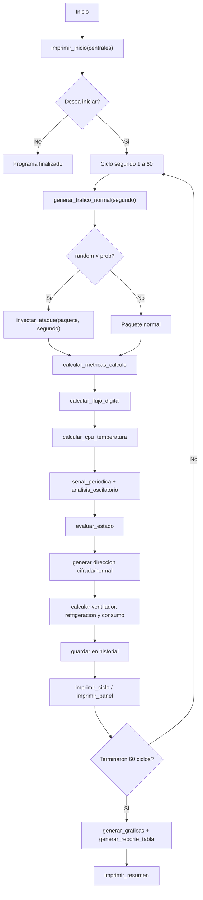
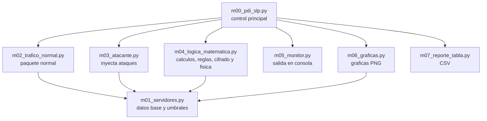
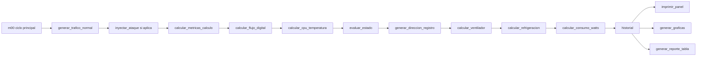
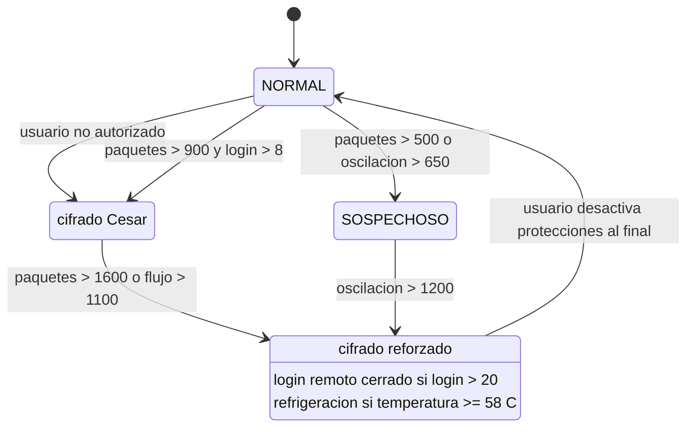
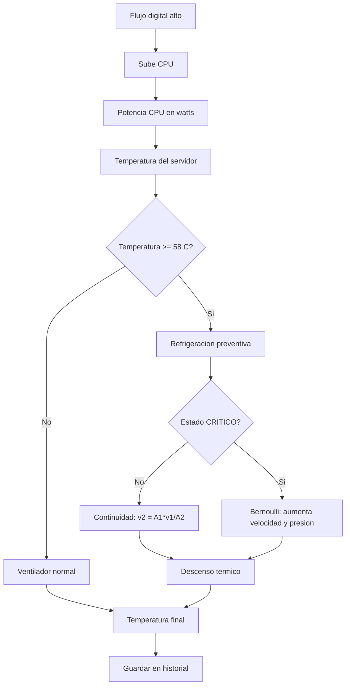
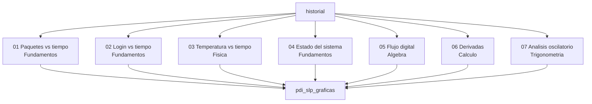

# Puntos para agregar en Word

Este material esta preparado para insertar tablas, ecuaciones, capturas, UML y fragmentos de codigo en el documento final del proyecto PDI SLP - Cyber Defense System.

## 1. Tabla de variables principales

| Variable | Archivo | Tipo | Uso en el sistema |
|---|---|---|---|
| `estado_actual` | `m00_pdi_slp.py` | diccionario | Guarda estado, cifrado, refrigeracion, IPs bloqueadas e historial. |
| `estado_calculo` | `m00_pdi_slp.py` / `m04_logica_matematica.py` | diccionario | Guarda datos anteriores para calcular tasa y derivadas. |
| `total_incidentes` | `m00_pdi_slp.py` | entero | Cuenta cuantos ataques fueron inyectados durante la simulacion. |
| `segundo` | `m00_pdi_slp.py` | entero | Controla el ciclo de simulacion de 1 a 60. |
| `prob` | `m00_pdi_slp.py` | decimal | Define la probabilidad de ataque segun el tramo de tiempo. |
| `paquete` | `m02_trafico_normal.py` | diccionario | Contiene los datos digitales y fisicos de cada segundo. |
| `metricas_calculo` | `m04_logica_matematica.py` | diccionario | Devuelve tasa, primera derivada y segunda derivada. |
| `flujo` | `m04_logica_matematica.py` | decimal | Indice ponderado del comportamiento digital. |
| `senal` | `m04_logica_matematica.py` | decimal | Patron periodico esperado del trafico normal. |
| `indice_oscilatorio` | `m04_logica_matematica.py` | decimal | Diferencia entre paquetes reales y senal esperada. |
| `alertas` | `m04_logica_matematica.py` | lista | Mensajes que explican la condicion de riesgo. |
| `protecciones` | `m04_logica_matematica.py` | lista | Acciones defensivas activadas por el sistema. |

## 2. Tabla de variables del paquete

| Clave del paquete | Descripcion | Materia relacionada |
|---|---|---|
| `segundo` | Tiempo actual de la simulacion. | Metodologia / Calculo |
| `central` | Central monitoreada: norte, centro o sur. | Metodologia |
| `usuario` | Agente o usuario que genera la actividad. | Fundamentos |
| `ip` | Direccion IP origen. | Fundamentos |
| `expediente` | Tipo de registro o expediente simulado. | Metodologia |
| `carpeta_id` | Identificador de carpeta de investigacion. | Metodologia |
| `paquetes` | Cantidad de paquetes por segundo. | Calculo |
| `intentos_login` | Intentos de acceso remoto. | Fundamentos |
| `cambios_archivos` | Cambios detectados en expedientes o evidencias. | Fundamentos |
| `salida_datos` | Datos salientes en MB. | Algebra / Fundamentos |
| `cpu_base` | Base inicial de uso de CPU. | Fisica |
| `cpu` | Uso calculado de CPU. | Fisica |
| `potencia_cpu_watts` | Potencia de CPU en watts. | Fisica |
| `temperatura` | Temperatura final despues de ventilacion/refrigeracion. | Fisica |
| `temperatura_sin_enfriamiento` | Temperatura antes de aplicar enfriamiento. | Fisica |
| `incidente` | Indica si el paquete fue alterado por ataque. | Fundamentos |
| `tipo_incidente` | Nombre del ataque aplicado. | Fundamentos |
| `direccion_registro` | Ruta normal o cifrada. | Fundamentos |
| `direccion_servidor` | Ruta descifrada mostrada como enlace interno. | Fundamentos |

## 3. Tabla de umbrales

| Umbral | Valor | Significado |
|---|---:|---|
| `U_PAQUETES_SOSP` | 500 | Trafico sospechoso. |
| `U_PAQUETES_ALERTA` | 900 | Trafico en nivel de alerta. |
| `U_PAQUETES_CRIT` | 1600 | Trafico critico. |
| `U_LOGIN_ALERTA` | 8 | Intentos de login en alerta. |
| `U_LOGIN_CRIT` | 20 | Intentos de login criticos. |
| `U_CAMBIOS` | 8 | Cambios de archivos sospechosos. |
| `U_SALIDA_DATOS` | 40 | Salida de datos elevada. |
| `U_CPU_ALTO` | 80 | CPU alto como referencia. |
| `U_TEMP_REFRIG` | 58 | Temperatura donde se activa refrigeracion. |
| `U_TEMP_CRITICA` | 68 | Temperatura critica. |
| `U_FLUJO_ELEVADO` | 350 | Flujo digital elevado. |
| `U_FLUJO_RIESGO` | 700 | Flujo digital en riesgo. |
| `U_FLUJO_CRITICO` | 1100 | Flujo digital critico. |
| `U_TASA` | 250 | Cambio brusco entre segundos. |
| `U_OSCILACION_SOSP` | 650 | Oscilacion sospechosa. |
| `U_OSCILACION_CRIT` | 1200 | Oscilacion critica. |

## 4. UML flujo general del sistema



## 5. UML archivos y dependencias



## 6. Tabla de funciones principales

| Funcion | Archivo | Uso principal |
|---|---|---|
| `generar_trafico_normal` | `m02_trafico_normal.py` | Crea el paquete base de cada segundo. |
| `inyectar_ataque` | `m03_atacante.py` | Altera el paquete para simular ataque. |
| `crear_estado_calculo` | `m04_logica_matematica.py` | Inicia valores anteriores para calculo. |
| `calcular_metricas_calculo` | `m04_logica_matematica.py` | Calcula tasa, primera y segunda derivada. |
| `calcular_flujo_digital` | `m04_logica_matematica.py` | Calcula el indice ponderado de flujo. |
| `senal_periodica` | `m04_logica_matematica.py` | Genera una senal seno-coseno esperada. |
| `calcular_analisis_oscilatorio` | `m04_logica_matematica.py` | Compara paquetes reales contra la senal esperada. |
| `evaluar_estado` | `m04_logica_matematica.py` | Decide NORMAL, SOSPECHOSO, ALERTA o CRITICO. |
| `cifrado_cesar` | `m04_logica_matematica.py` | Aplica desplazamiento Cesar. |
| `cifrado_multiplicativo` | `m04_logica_matematica.py` | Aplica cifrado modular multiplicativo. |
| `cifrado_reforzado` | `m04_logica_matematica.py` | Combina Cesar + multiplicativo. |
| `calcular_cpu_temperatura` | `m04_logica_matematica.py` | Relaciona flujo digital, CPU, potencia y temperatura. |
| `calcular_refrigeracion` | `m04_logica_matematica.py` | Aplica continuidad y Bernoulli en estado critico. |
| `calcular_consumo_watts` | `m04_logica_matematica.py` | Suma consumo del sistema, CPU, ventilador y bomba. |
| `generar_graficas` | `m06_graficas.py` | Genera las imagenes PNG. |
| `generar_reporte_tabla` | `m07_reporte_tabla.py` | Exporta el historial a CSV. |

## 7. UML funciones principales



## 8. UML estados y proteccion



## 9. Ejemplo de cifrado Cesar

Texto original usado por el sistema:

```text
central_norte/ci-2026-220325/datos_01.log
```

Con clave Cesar `d = 3`, cada letra avanza tres posiciones.

$$
C = (p + d) mod 26
$$

Resultado:

```text
fhqwudo_qruwh/fl-2026-220325/gdwrv_01.orj
```

## 10. Ejemplo de cifrado multiplicativo

Texto original:

```text
central_norte/ci-2026-220325/datos_01.log
```

Para letras se usa clave `a = 5` y modulo `26`. Para numeros se usa `a = 7`, ajuste `b = 3` y modulo `10`.

$$
C_letra = (p * 5) mod 26
$$

$$
C_numero = (n * 7 + 3) mod 10
$$

Resultado:

```text
kunrhad_nshru/ko-7375-773478/parsm_30.dse
```

## 11. Fragmento de codigo de cifrado

```python
def cifrado_cesar(texto, d):
    resultado = ""
    for c in texto:
        if c.isalpha():
            base = ord('A') if c.isupper() else ord('a')
            resultado = resultado + chr((ord(c) - base + d) % 26 + base)
        else:
            resultado = resultado + c
    return resultado

def cifrado_reforzado(texto):
    return cifrado_multiplicativo(cifrado_cesar(texto, CLAVE_CESAR))
```

## 12. UML refrigeracion



## 13. UML graficas por materia



## 14. Captura del CSV generado

Archivo generado:

```text
reportes_tabla/pdi_slp_reporte_tabla.csv
```


## 15. Captura de consola del sistema

Archivo base de la captura:

```text
capturas_word/captura_consola.txt
```


## 16. Formula de tasa de cambio

$$
Tasa = P(t) - P(t-1)
$$

En el codigo, esta formula se usa para comparar los paquetes actuales contra los paquetes del segundo anterior.

## 17. Formula de primera derivada

$$
P'(t) = (P(t) - P(t-1)) / Delta_t
$$

Como la simulacion avanza segundo por segundo, normalmente `Delta_t = 1`.

## 18. Formula de segunda derivada

$$
P''(t) = (P'(t) - P'(t-1)) / Delta_t
$$

Esta formula detecta si el cambio del trafico se esta acelerando o frenando.

## 19. Formula de sigmoide

$$
S(x) = 1 / (1 + e^(-x))
$$

En el proyecto se usa para suavizar derivadas y evitar que valores extremos dominen todo el analisis.

## 20. Fragmento de codigo de calculo

```python
def calcular_tasa(actual, anterior):
    return actual - anterior

def calcular_derivada_discreta(actual, anterior, delta_t=1):
    if delta_t == 0:
        return 0
    return round((actual - anterior) / delta_t, 2)

def calcular_segunda_derivada(derivada_actual, derivada_anterior, delta_t=1):
    if delta_t == 0:
        return 0
    return round((derivada_actual - derivada_anterior) / delta_t, 2)
```

## 21. Formula del flujo digital

$$
F = 0.45P + 0.25L + 0.15A + 0.15D
$$

Donde `P` son paquetes, `L` intentos de login, `A` cambios de archivos y `D` salida de datos.

## 22. Formula de senal periodica

$$
S(t) = A sin(wt) + B cos(wt)
$$

En el codigo se usan los valores `A = 45`, `B = 18` y `w = 0.3`.

## 23. Formula del indice oscilatorio

$$
I_o = |P(t) - S(t)|
$$

Si este indice aumenta demasiado, el trafico se aleja del patron esperado.

## 24. Fragmento de codigo de algebra

```python
def calcular_flujo_digital(paquetes, intentos_login, cambios_archivos, salida_datos):
    return round(paquetes * 0.45 + intentos_login * 0.25 +
                 cambios_archivos * 0.15 + salida_datos * 0.15, 2)

def senal_periodica(t, A=45, B=18, w=0.3):
    return round(A * math.sin(w * t) + B * math.cos(w * t), 2)

def calcular_analisis_oscilatorio(paquetes, senal):
    desviacion_periodica = round(abs(paquetes - senal), 2)
    indice_oscilatorio = desviacion_periodica
    return desviacion_periodica, indice_oscilatorio
```

## 25. Tabla de reglas logicas

| Condicion | Estado/proteccion resultante |
|---|---|
| Usuario no autorizado | Estado `ALERTA`. |
| Paquetes > 900 y login > 8 | Estado `ALERTA` y activa `CIFRADO`. |
| Cambios de archivos > 8 | Alerta de manipulacion de expediente. |
| Salida de datos > 40 MB | Alerta de salida elevada y puede activar cifrado. |
| Paquetes > 1600 o flujo > 1100 | Estado `CRITICO` y `CIFRADO REFORZADO`. |
| Indice oscilatorio > 1200 | Estado `CRITICO` y registro de analisis oscilatorio. |
| Indice oscilatorio > 650 | Estado `SOSPECHOSO` si no habia otra alerta. |
| Intentos login > 20 | Proteccion: login remoto cerrado. |
| Temperatura sin enfriamiento >= 68 C | Proteccion: refrigeracion activada. |

## 26. Ejemplo y cifrado Cesar

Ejemplo corto para explicar en clase:

```text
Texto: PDI
Clave: 3
Resultado: SGL
```

Operacion por letra:

$$
P -> S,\quad D -> G,\quad I -> L
$$

## 27. Ejemplo de cifrado multiplicativo

Ejemplo corto:

```text
Texto: PDI
Clave letras: 5
Resultado: XPM
```

La posicion de cada letra se multiplica por 5 y se aplica modulo 26.

$$
C = (p * 5) mod 26
$$

## 28. Fragmento de codigo de evaluacion y cifrado

```python
def evaluar_estado(paquete, flujo, cifrado_actual, indice_oscilatorio):
    alertas = []
    protecciones = []
    estado = "NORMAL"
    cifrado = cifrado_actual

    if paquete["usuario"] not in srv.agentes_autorizados:
        alertas.append("ACCESO NO AUTORIZADO: " + paquete["usuario"])
        estado = "ALERTA"

    if paquete["paquetes"] > srv.U_PAQUETES_ALERTA and paquete["intentos_login"] > srv.U_LOGIN_ALERTA:
        alertas.append("TRAFICO MASIVO + FUERZA BRUTA")
        estado = "ALERTA"
        if cifrado == "NINGUNO":
            cifrado = "CIFRADO"
            protecciones.append("CIFRADO ACTIVADO")

    if paquete["paquetes"] > srv.U_PAQUETES_CRIT or flujo > srv.U_FLUJO_CRITICO:
        estado = "CRITICO"
        cifrado = "REFORZADO"
        alertas.append("FLUJO O TRAFICO CRITICO")
        protecciones.append("CIFRADO REFORZADO ACTIVADO")

    return estado, alertas, protecciones, cifrado
```

## 29. Ecuacion de potencia

$$
P_cpu = (CPU / 100) * P_max
$$

En el sistema `P_max = 120 W`, por eso si la CPU sube, tambien sube la potencia calculada.

## 30. Ecuacion de Bernoulli

$$
P_1 + (1/2) rho v_1^2 = P_2 + (1/2) rho v_2^2
$$

En el proyecto se usa para estimar la presion de entrada cuando el sistema esta en estado critico.

## 31. Ecuacion de consumo energetico

$$
Consumo = C_base + P_cpu + C_ventilador + C_refrigerante
$$

El consumo del ventilador y del refrigerante aumenta con el cuadrado de la velocidad.

$$
C_ventilador = C_v * (v_actual / v_normal)^2
$$

$$
C_refrigerante = C_r * (v_refrigerante / 5)^2
$$

## 32. Fragmento de codigo de refrigeracion

```python
def calcular_refrigeracion(temperatura, estado):
    area_entrada = AREA_SALIDA_REFRIGERANTE * 2
    velocidad_entrada = COEFICIENTE_REFRIGERANTE_MS
    velocidad_base = (area_entrada * velocidad_entrada) / AREA_SALIDA_REFRIGERANTE

    presion_entrada = P1_REFRIGERANTE
    presion_salida = P1_REFRIGERANTE
    velocidad_refrigerante = velocidad_base

    if estado == "CRITICO":
        objetivo = srv.U_TEMP_REFRIG - 1
        descenso_necesario = temperatura - objetivo

        while velocidad_refrigerante <= 14.0:
            presion_entrada = round(
                presion_salida
                - 0.5 * RHO_REFRIGERANTE * velocidad_entrada ** 2
                + 0.5 * RHO_REFRIGERANTE * velocidad_refrigerante ** 2, 2
            )
            caida_relativa = max((presion_entrada - presion_salida) / presion_entrada, 0)
            descenso_refrigerante = round(4.4 * velocidad_refrigerante * caida_relativa, 2)
            if descenso_refrigerante >= descenso_necesario:
                break
            velocidad_refrigerante = velocidad_refrigerante + 0.1

    return round(velocidad_refrigerante, 2), presion_entrada, presion_salida, round(descenso_refrigerante, 2)
```

## 33. Archivos de evidencia para insertar

| Elemento | Ruta |
|---|---|
| Captura del CSV | `capturas_word/captura_csv_generado.png` |
| Captura de consola | `capturas_word/captura_consola_sistema.png` |
| Texto completo de consola | `capturas_word/captura_consola.txt` |
| CSV generado | `reportes_tabla/pdi_slp_reporte_tabla.csv` |
| Grafica paquetes | `pdi_slp_graficas/01_paquetes_vs_tiempo.png` |
| Grafica login | `pdi_slp_graficas/02_intentos_login_vs_tiempo.png` |
| Grafica temperatura | `pdi_slp_graficas/03_temperatura_vs_tiempo.png` |
| Grafica estado | `pdi_slp_graficas/04_estado_sistema_vs_tiempo.png` |
| Grafica flujo | `pdi_slp_graficas/05_indice_flujo_digital_vs_tiempo.png` |
| Grafica derivadas | `pdi_slp_graficas/06_derivadas_trafico_vs_tiempo.png` |
| Grafica oscilatoria | `pdi_slp_graficas/07_analisis_oscilatorio_vs_tiempo.png` |
