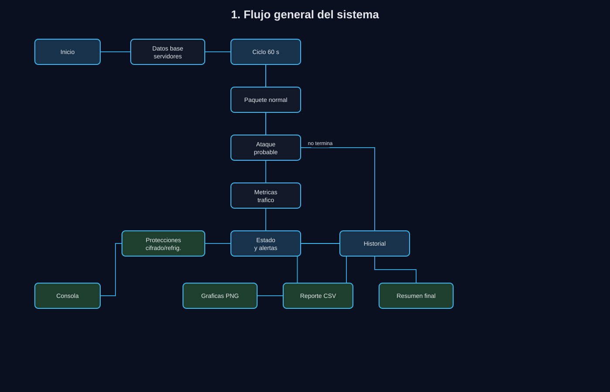
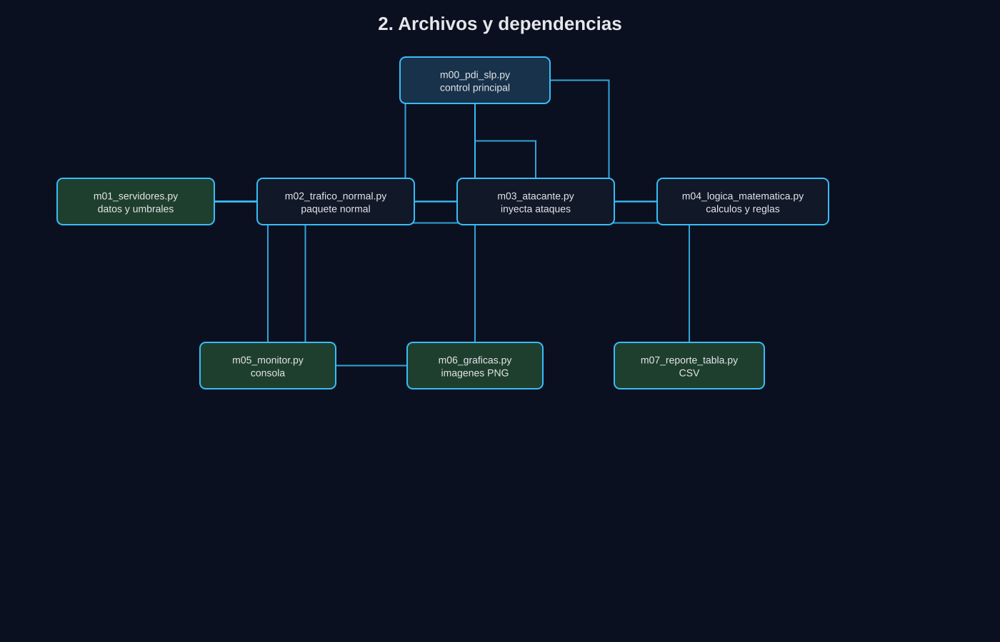
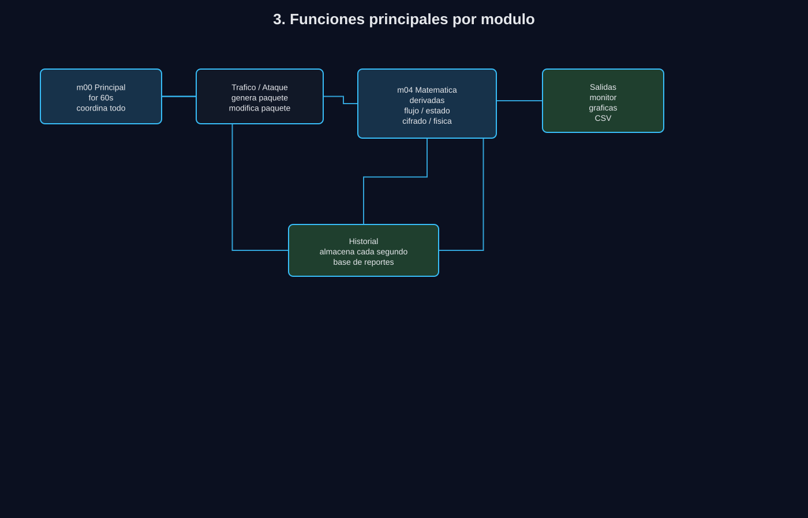
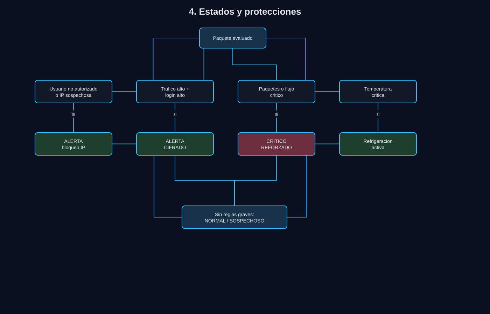
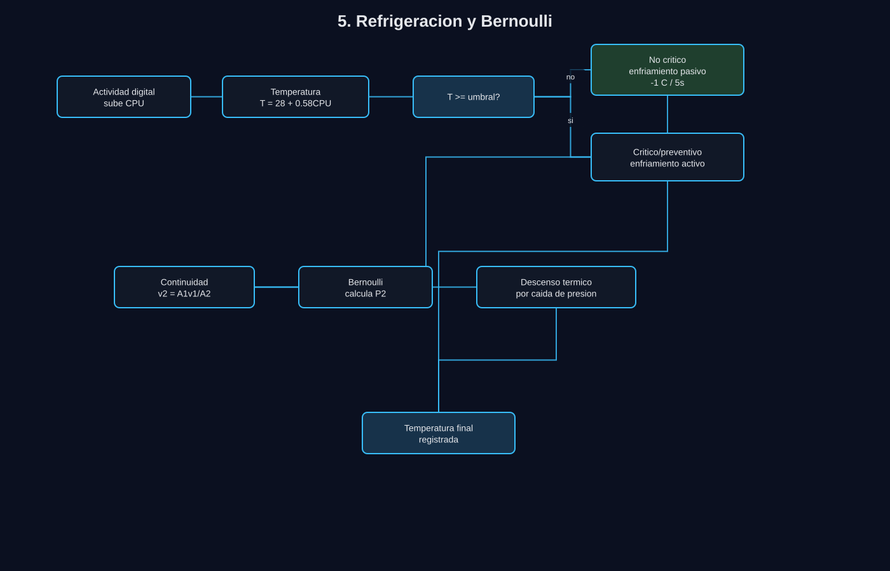
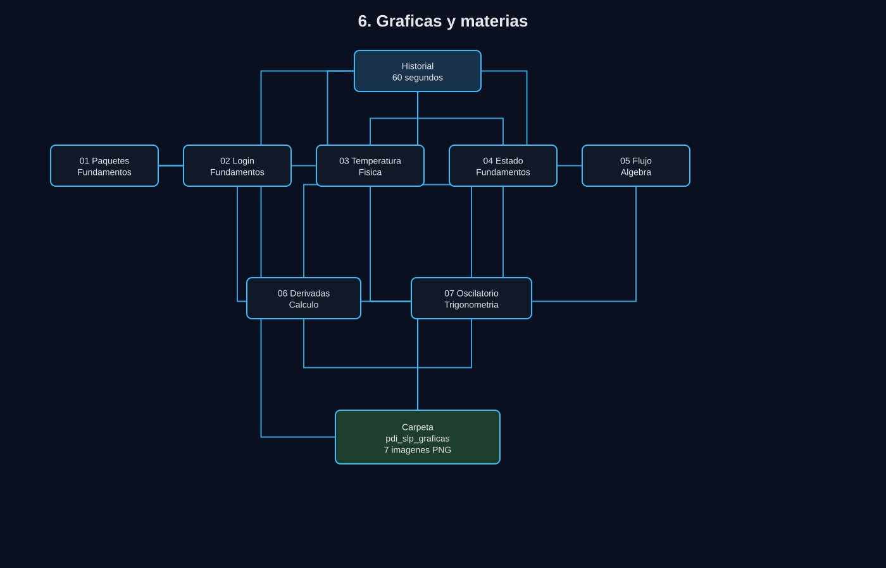

# UML - PDI SLP Cyber Defense System

Este documento usa archivos `.svg` para ver los diagramas. Para editarlos en draw.io se deben abrir los archivos `.drawio` del mismo nombre.

Los graficos estan guardados en:

```text
uml_graficos/
```

## 1. Flujo general



Este diagrama muestra el recorrido completo: inicio, carga de datos, ciclo de 60 segundos, calculos, estado, protecciones, historial y reportes.

## 2. Archivos y dependencias



Este diagrama muestra que `m00_pdi_slp.py` controla el sistema y llama a los modulos de trafico, atacante, logica matematica, monitor, graficas y CSV.

## 3. Funciones principales



Este diagrama resume las funciones principales por archivo, separando el flujo principal, la logica matematica, la generacion de trafico/ataques y las salidas.

## 4. Estados y protecciones



Este diagrama resume como el sistema pasa a `NORMAL`, `SOSPECHOSO`, `ALERTA` o `CRITICO`, y que protecciones puede activar.

## 5. Refrigeracion



Este diagrama muestra como la temperatura sale del CPU, como se decide la refrigeracion y como se usa continuidad/Bernoulli para calcular el enfriamiento.

## 6. Graficas y materias



Este diagrama muestra que todas las graficas nacen del historial y como se relacionan con las materias del proyecto.

## Lectura rapida

El programa empieza en `m00_pdi_slp.py`, genera un paquete por segundo, puede modificarlo con un ataque, calcula metricas, evalua reglas, aplica protecciones, guarda historial y al final manda ese historial a graficas y CSV.

La parte de analisis matematico vive principalmente en `m04_logica_matematica.py`. Las imagenes no recalculan el sistema; solo representan lo que ya hace el programa.

